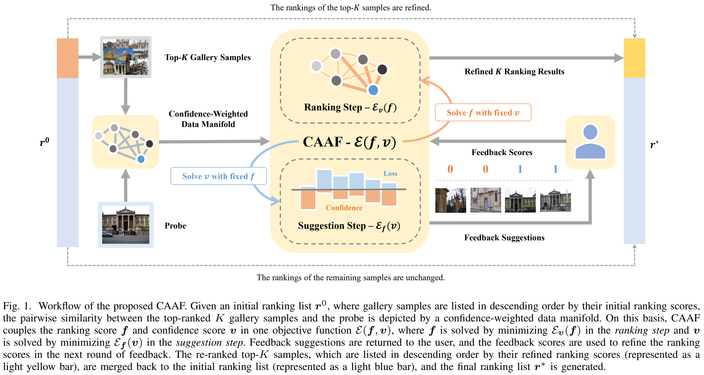

# CAAF: Confidence-Aware Active Feedback

<!--正式发表后修改原文链接-->
This repo is the official implementation of ["Confidence-Aware Active Feedback for Interactive Instance Search"](https://arxiv.org/abs/2110.12255) by Yue Zhang, Chao Liang and Longxiang Jiang.

## Introduction

CAAF is specifically designed for interactive instance search (INS) tasks to improve the interaction efficiency by actively selecting the most valuable samples for relevance feedback. 



Inspired by the explicit difficulty modeling scheme in self-paced learning, CAAF utilizes a pairwise manifold ranking loss to evaluate the ranking confidence of each unlabeled sample. The ranking confidence improves not only the interaction efficiency by indicating valuable feedback candidates but also the ranking quality by modulating the diffusion weights in manifold ranking. In addition, we design two acceleration strategies, an approximate optimization scheme and a top-$K$ search scheme, to reduce the computational complexity of CAAF. 

Compared with existing active learning methods, CAAF gains better performance in INS tasks and takes less time to solve. Notably, in the real-world, large-scale video INS task of NIST TRECVID 2021, CAAF uses 25% fewer feedback samples to achieve a performance that is nearly equivalent to the champion solution. Moreover, with the same number of feedback samples, CAAF’s mAP is 51.9%, significantly surpassing the champion solution by 5.9%.

## Requirements

    python 3.8.12
    numpy 1.21.4
    torch 1.10.0+cu113

## Usage

``` python
import numpy as np
from caaf import CAAF

'''
all_idx: the original indices of the top-K samples in the gallery.
all_init_rank: the inital rankings of all samples in the gallery.
all_W: the affinity matrices computed with the queries and their top-K candidates.
tot_query_num: the number of queries.
tot_gallery_num: the size of the original gallery set (N).
tot_fb_round: the the maximum round of feedback.
fb_num: the number of feedback samples per round.
'''

dist_mat = np.zeros((tot_query_num,tot_gallery_num,tot_fb_round)) # the final distance

# for each query
for i in range(0, tot_query_num):

    # prepare data for the i-th query
    idx = all_idx[i,:] # (K,)
    init_rank = all_init_rank[i,:] # (N,)
    W = all_W[i,:,:] # (K+1,K+1)

    # construct the model
    model = CAAF(W)

    # for each round
    for j in range(0, tot_fb_round):

        # solve CAAF
        temp_f = model.optimize()

        # collect ranking scores
        top_f = temp_f[0:K]
        f_idx = np.argsort(-top_f)
        rank_f = np.argsort(f_idx)
        init_rank[idx] = rank_f # only the top-K samples in the inital ranking list are updated
        dist_mat[i,:,j] = init_rank # for simplicity, we take the ranking as the distance 

        # collect feedback suggestions
        fb_id = model.select(fb_num)
        ori_id = idx[fb_id] # convert the index to the original index
        fb_score = obtain_fb_score(ori_id) # please implemet this portal according to your own system

        # update the parameters
        model.update(fb_id,fb_score)

```

## Citation

If you find this repository useful, please consider giving ⭐ or citing:

<!--正式发表后修改bibtex-->

```
@article{DBLP:journals/corr/abs-2110-12255,
  author    = {Yue Zhang and
               Chao Liang and
               Longxiang Jiang},
  title     = {Confidence-Aware Active Feedback for Efficient Instance Search},
  journal   = {CoRR},
  volume    = {abs/2110.12255},
  year      = {2021}
}
```
